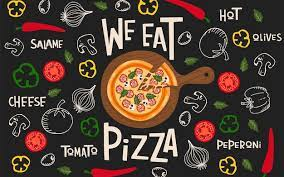
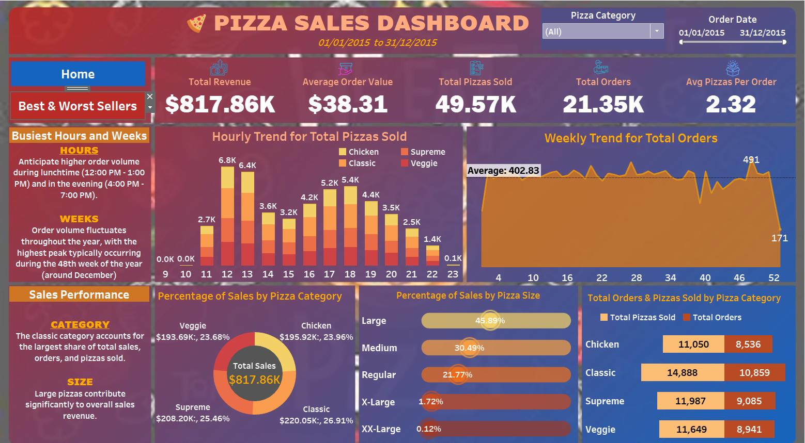
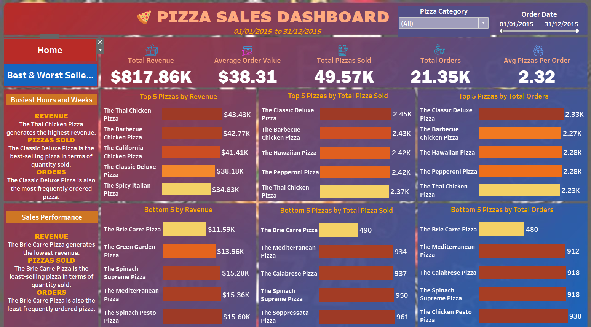

# Pizza-Sales-Analysis



## Overview
This project analyses key indicators for pizza sales data to gain insight into the pizza business's performance.The dataset was used for in-depth exploratory analysis using MS SQL Server and data visualization in Tableau. The analysis aimed to understand pizza sales trends, customer preferences, and popular pizza categories.

## Data Sources
The primary data source for this analysis is the [pizza_sales.csv](pizza_sales.csv) containing different information about the business in columns.

## Tools Used
- MS SQL Server: Import data, create database, write queries and create reports.
- Tableau: Connect to MS SQL Server, data processing and data visualisation

## Exploratory Data Analysis
EDA involved exploring the pizza sales data to answer the following key problem statements;
1. What are the busiest days and hours for orders?
2. Which pizza category generates the highest and least revenue?
3. Which pizza category are the most and least sold?
4. Which pizza category accounts for the largest share of sales and orders?

## Data Analysis (SQL Queries)
```sql
--The sum of the total price of all pizza orders.
SELECT SUM(total_price) as Total_Revenue 
FROM pizza_sales

--Average Pizzas Order
SELECT SUM(total_price)/COUNT(DISTINCT order_id) as Avg_Order_Value
FROM pizza_sales

--Total Pizza Sold
SELECT SUM(quantity) as Total_Pizza_Sold
FROM pizza_sales

--The total number of orders placed
SELECT COUNT(DISTINCT order_id) as Total_Orders
FROM pizza_sales

-- Average Pizza Sold per Order
SELECT CAST(CAST(SUM(quantity)as DECIMAL(10,2)) /CAST(COUNT(DISTINCT order_id) as DECIMAL(10,2)) as DECIMAL(10,2)) as Avg_Pizza_per_Order
FROM pizza_sales

-- Hourly Trend for Total Orders
SELECT DATEPART(HOUR, order_time) as order_hour, SUM(quantity) as Total_Pizzas_Sold 
FROM pizza_sales
GROUP BY DATEPART(HOUR, order_time)
ORDER BY DATEPART(HOUR, order_time)

-- Weekly Trend for Total Orders
SELECT DATEPART(ISO_WEEK, order_date) as week_number, YEAR(order_date) as Order_Year, COUNT(DISTINCT order_id) as Total_Orders
FROM pizza_sales
GROUP BY DATEPART(ISO_WEEK, order_date), YEAR(order_date) 
ORDER BY DATEPART(ISO_WEEK, order_date), YEAR(order_date) 

-- Percentage of Sales by Pizza Category
SELECT pizza_category, CAST(SUM(total_price)*100/(SELECT sum(total_price) from pizza_sales)as DECIMAL(10,2)) as Percent_Total_Sales
FROM pizza_sales
GROUP BY pizza_category

-- Percentage of Sales by Pizza Size
SELECT pizza_size, CAST(SUM(total_price)*100/(SELECT SUM(total_price) from pizza_sales) as DECIMAL(10,2)) as Percent_Total_Sales
FROM pizza_sales
GROUP BY pizza_size

-- Total pizza Sold by Pizza Category
SELECT pizza_category, SUM(quantity) as Total_Sold
FROM pizza_sales
GROUP BY pizza_category

-- Top 5 Best Sellers by Revenue 
SELECT TOP 5 pizza_name, SUM(total_price) as Total_Revenue
FROM pizza_sales
GROUP BY pizza_name
ORDER BY Total_Revenue DESC

-- Bottom 5 Sellers by Revenue
SELECT TOP 5 pizza_name, SUM(total_price) as Total_Revenue
FROM pizza_sales
GROUP BY pizza_name
ORDER BY Total_Revenue

-- Top 5 Best Sellers by Total Quantity
SELECT TOP 5 pizza_name, SUM(quantity) as Total_Quantity
FROM pizza_sales
GROUP BY pizza_name
ORDER BY Total_Quantity DESC

-- Bottom 5 Sellers by Total Quantity
SELECT TOP 5 pizza_name, SUM(quantity) as Total_Quantity
FROM pizza_sales
GROUP BY pizza_name
ORDER BY Total_Quantity
 
-- Top 5 Sellers by Total Orders
SELECT TOP 5 pizza_name, COUNT(DISTINCT order_id)  as Total_Orders
FROM pizza_sales
GROUP BY pizza_name
ORDER BY Total_Orders DESC
 
-- Bottom 5 Sellers by Total Orders
SELECT TOP 5 pizza_name, COUNT(DISTINCT order_id)  as Total_Orders
FROM pizza_sales
GROUP BY pizza_name
ORDER BY Total_Orders
```
## Data Visualisation Tableau

|Home|Best and Worst Sellers|
|-------|-------|
|||

The report can be accessed and interacted with [here]([Pizza.twb](https://public.tableau.com/app/profile/faad.yusuf/viz/Pizza_16993999897930/BestWorstSellers?publish=yes)
## Findings
- Peak order is mostly during lunchtime (12:00 PM - 1:00 PM) and in the evening (4:00 PM - 7:00 PM).
- Order volume fluctuates throughout the year, with the highest peak typically occurring during the 48th week of the year (around December).
- The classic category accounts for the largest share of total sales, orders, and pizzas sold.
- Large pizzas contribute significantly to overall sales revenue.
- The Thai Chicken Pizza generates the highest revenue.
- The Classic Deluxe Pizza is the best-selling pizza in terms of quantity sold.
- The Classic Deluxe Pizza is also the most frequently ordered.
- The Brie Carre Pizza generates the lowest revenue.
- The Brie Carre Pizza is the least-selling pizza in terms of quantity sold.
- The Brie Carre Pizza is also the least frequently ordered pizza.

 ## Recommendations
- Optimize staffing and resources during peak order times (lunchtime and evening) to ensure timely order preparation and delivery.
- Offer targeted promotions and discounts during off-peak hours e.g. it could offer a discount on pizzas ordered between 2:00 PM and 4:00 PM, or offer a free appetizer to customers who order during the early evening. 
- The Classic category pizzas account for the largest share of total sales, orders, and pizzas sold. The organization should focus its marketing efforts on promoting these pizzas, as they are the most popular with customers.
- Since large pizzas contribute significantly to overall sales revenue, the organization could offer bundle deals that include large pizzas. For example, it could offer a bundle deal that includes a large pizza, two sides, and two drinks.
- Investigate the reasons behind the poor performance of the Brie Carre Pizza as it generates the lowest revenue and is the least-selling pizza in terms of quantity sold and frequency ordered. It may be necessary to reevaluate the pizza's ingredients, pricing, or marketing.
- Conducting customer surveys to gather feedback on the menu, pricing, and overall experience.
- Continue to market the Classic Deluxe Pizza, as it is the best-selling pizza in terms of quantity sold and order frequency. The organisation can also consider creating bundle deals that include this pizza.
- Leverage the popularity of the Thai Chicken Pizza by promoting it as a flagship product and potentially expanding the menu with similar options.


 


 


